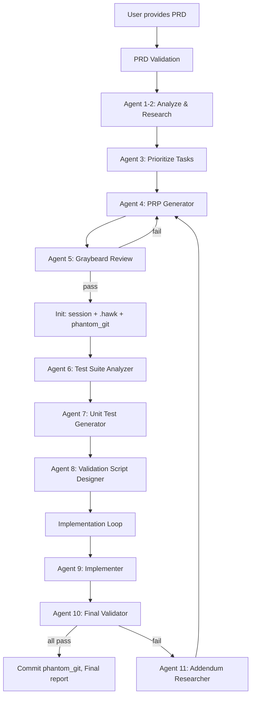
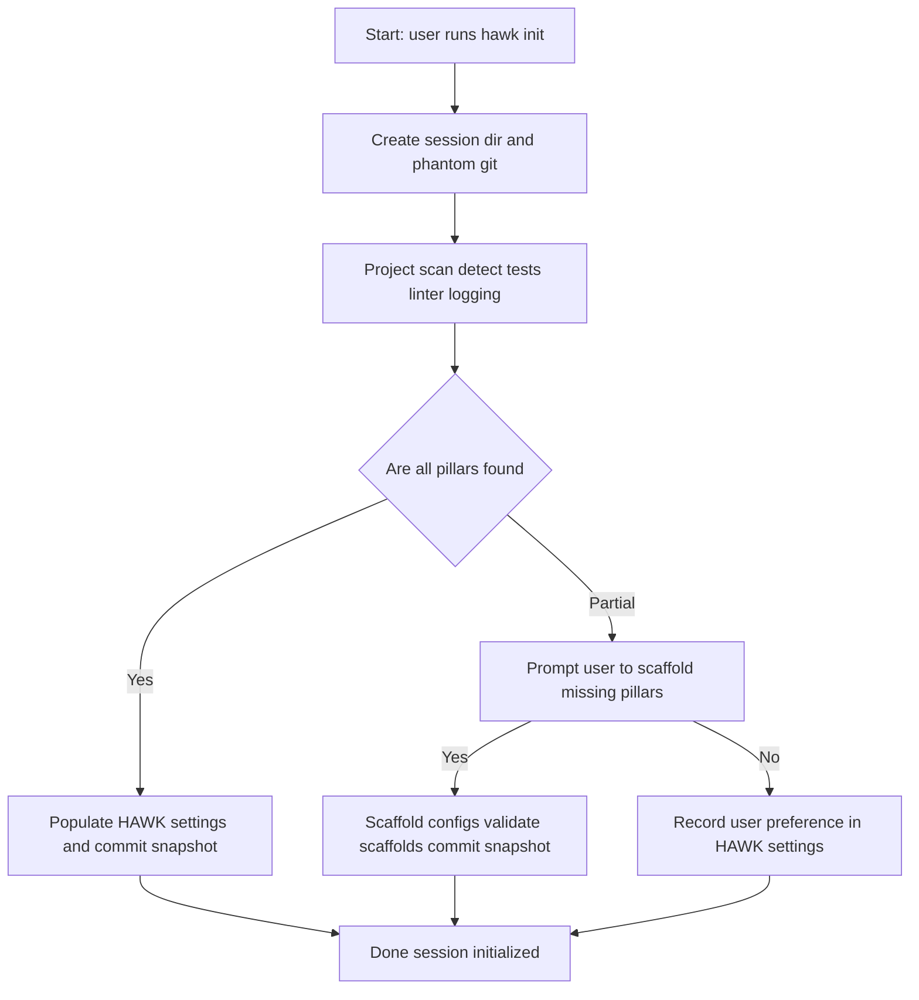
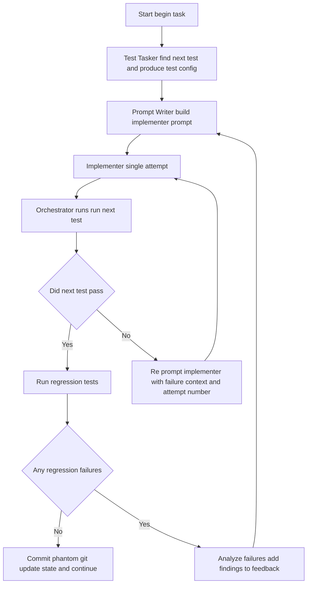

# PRD: Hawk Agent — Unified Agentic PRP + Test Runner Orchestration System (Merged)

**Version:** 2025-11-03
**Owner:** Dustin Schultz / Engineering / AI Platform Team
**Priority order:**

1. User update prompts (`<update_prompt_1>`, `<update_prompt_2>`) — **highest priority**
2. `test_runner` PRD (merged)
3. `prd_pipeline` PRD (merged)
4. `single_test` PRD (merged)

**Status:** Brainstorming / Design. Many items marked **TBD** per user.

---

## Executive Summary

Hawk Agent is an orchestration system that converts Product Requirements Documents (PRDs) into implemented features using a structured multi-agent pipeline. It combines:

* The original `prd_pipeline` multi-agent architecture (Agents 1–11, PRD validation, main execution loop, retry logic, etc.),
* The `test_runner` TDD orchestration with deterministic test runner contracts and session persistence,
* The `single_test` specific TDD-runner ideas for one-feature runs,
* Your new architecture notes: session-per-project state under `~/.local/state/hawk_agent/...`, phantom `.git` in session, `.hawk` dotfile for project settings, Workflows (React-like but not overfit), Sagas for orchestration, and emphasis on the three pillars (Testing, Logging, Linting).

This document is a complete merge: every agent description, flow, error-handling details, agent retry logic, test-runner contracts, session schemas, and your new orchestration, UI, and state ideas are included. Conflicts resolved in favor of your latest prompts.

---

## Table of Contents

1. Executive Summary
2. Goals & Success Criteria
3. System Overview & Main Flow (Mermaid)
4. Core Components and Full Agent List (merged)
5. PRD Validation Pre-Processing (Agents A & B)
6. Main Execution Loop & Agent Interactions (detailed)
7. Retry Strategies, Error Handling, Timeouts (full original + updates)
8. Storage & Session Model: `.hawk`, phantom Git, session layout
9. Workflows, Agents, Sagas, Inter-Agent Communication (Props, Context, Store)
10. Orchestration UI & Tree Navigation (drill-in agent tree)
11. The Three Pillars: Testing, Logging, Linting (detailed, with tools)
12. Test Runner Contracts & APIs (`run_next_test`, `run_regression_tests`, `modify_test`)
13. TDD / Implementation Loop (full, with attempt/complexity mapping)
14. Validation, Unit Tests, & Test Suite Analyzer behaviors
15. Implementation Agent / Incremental Execution & Specialist Agents
16. Addendum Mode & Root Cause Analysis
17. Observability: Logging, JSONL, Tracing & Metrics
18. Security, Sandbox & Execution Environment — **TBD** items noted
19. Future Enhancements & Outstanding TBDs
20. Appendices: JSON Schemas, Exit Codes, Example state files, Mermaid subflows

---

# 2. Goals & Success Criteria

(Combined and prioritized — your updates have priority.)

**Primary Goals**

* Convert PRDs into working features via a structured 11-agent pipeline while preserving project integrity and keeping the project in a working state throughout.
* Provide a local session store: `~/.local/state/hawk_agent/<absolute_path_to_session_cwd>/<session_uid>/`.
* Provide a phantom `.git` inside each session dir to track and rollback any change to the working tree (track all files, ignore `.gitignore`).
* Make every process runnable in isolation (single test, PRP creation, TDD loop, etc.) and composable into an orchestration layer.
* Provide a UI (initial TUI possible with `ink`) with the ability to drill into child agents/workflows and two-way human-in-the-loop (HITL) interactions.
* Implement a consistent set of tooling contracts for deterministic TDD: `run_next_test`, `run_regression_tests`, `modify_test`.
* Emphasize three pillars: Testing, Logging, Linting (discover, scaffold, enable, validate).
* Use Sagas for long-running orchestration and compensating rollbacks.

**Success Criteria**

* Deterministic test runs for scoped features (pass/fail in machine-readable JSON).
* Session persistence and resumable runs using the session store & phantom_git.
* UI can navigate nested agents and respond to HITL requests.
* When tests pass for a scoped task, commit to phantom_git; on failures, generate actionable structured reports and addendums.
* Full JSON schema validation enforced across agents.

---

# 3. System Overview & Main Flow (Mermaid)

This combines the main flow from `prd_pipeline` with the `test_runner` loop and your updates.



---

# 4. Core Components and Full Agent List (Merged, detailed)

All agents from `prd_pipeline`, plus test runner-specific roles from `test_runner` and `single_test`. Where duplicate functionality existed, merged responsibilities are combined.

### Agent A (PRD Information Gap Analyzer)

* Scan PRD, identify 10 gaps, categorize as critical/important/nice-to-have, propose targeted clarifying questions.

### Agent B (PRD Gap Validator)

* Filter Agent A's gaps for relevance; create user-facing questions; justify dismissed gaps.

### Agent 1-2: PRD Analyzer + Researcher (Combined)

* Analyze PRD complexity, run codebase analysis, web research, propose breakdown strategy, output JSON metadata (task_analysis, specialist_agents, api_contracts).

*Outputs/metadata sample*:

```json
{
  "task_analysis": {"complexity":"medium", "estimated_story_points":5, "breakdown_required":true},
  "specialist_agents":[{"expert":"React","focus":"component design"}],
  "api_contracts": {"endpoints":[], "types":[], "interfaces":[]}
}
```

### Agent 3: Task Prioritizer + Workstream Organizer

* Analyze dependencies; produce execution order & safe parallel groups (use workstream notation as in original PRD).

### Agent 4: PRP Generator

* Convert tasks to PRPs with detailed steps, prompts for specialist agents, rollback strategies, testability at each step.

### Agent 5: Critical Reviewer (Graybeard)

* Tough validation; iterative with Agent 4 up to 10 cycles; produce pass/fail and actionable changes.

### Agent 6: Test Suite Analyzer

* Determine test framework, runner, patterns, gaps. Output boolean `test_suite_present` and structured testing description.

### Agent 7: Unit Test Generator

* Create core unit tests aligned with PRP and Agent 6 standards.

### Agent 8: Validation Script Designer

* Create validation scripts (try <300 lines), manual validation where automation infeasible, select MCP tools for validation.

### Agent 9: Implementation Agent

* Execute PRP incrementally, test after each change, maintain working state, handle rollbacks, deploy specialist agents.

### Agent 10: Final Validator

* Execute unit tests and validation scripts, stage changes to phantom_git on success; trigger addendum on failure.

### Agent 11: Addendum Researcher

* Research failures, propose minimal addendums, return to Agent 5 for review.

---

# 5. PRD Validation Pre-Processing (Agents A & B) — full loop

* Agent A finds 10 potential gaps and assigns priority.
* Agent B filters and creates user questions.
* User may supply answers, mark out-of-scope, or approve PRD.
* Loop continues (max 5 iterations) until no relevant gaps or user approves.
* If timeouts occur (user response >30 minutes), system may proceed per user-configured default.

---

# 6. Main Execution Loop & Agent Interactions (detailed merged flow)

The main execution loop is as in the original PRD, but augmented with session/phantom git and test_runner deterministic tooling:

1. PRD input accepted after validation.
2. Agent 1-2 analyze and research (may call web research unless disabled).
3. Agent 3 organizes tasks.
4. Agent 4 generates PRPs.
5. Agent 5 reviews (up to 10 cycles).
6. Init: session creation, phantom git, `.hawk` settings.
7. Agent 6 analyzes test suite.
8. Agent 7 generates tests (where needed).
9. Agent 8 crafts validation scripts.
10. Agent 9 implements in small increments; after each increment:

    * Call custom tool `run_next_test()` then `run_regression_tests()`.
    * Based on results, either commit snapshot to phantom_git or rollback.
11. Agent 10 validates fully and stages or triggers addendum.
12. If addendum required, Agent 11 researches and creates PRP addendum and returns to Agent 5 cycle.
13. System supports at most 2 main loops; sub-loops limited to 4 iterations; Agent 4-5 review loop max 10 cycles.

---

# 7. Retry Strategies, Error Handling, Timeouts (full original + updates)

**Agent-specific retry logic** (copied/retained from `prd_pipeline`) is included for all agents, with your update that agent run times and system timeouts are enforced, and attempts generate `attempt` records stored in `state.json`.

**Main loop retry**: two attempts. If second attempt fails, escalate to human intervention.

**Timeouts**:

* Research agents (1-2): 10 minutes per attempt
* Analysis agents (3,5-8): 5 minutes per attempt
* Implementation agents (4,9-11): 15 minutes per attempt
* System timeout: 2 hours total (configurable)

**Failure Classes**

* **Critical** (halt): git repo corruption, authentication failures, system resource exhaustion.
* **Recoverable**: network, API rate limits, minor implementation errors.
* **Degraded**: partial research, limited tests, simplified implementation.

**Logging and monitoring**: every error/retry captured in JSONL logs with timestamps and agent metadata.

---

# 8. Storage & Session Model: `.hawk`, phantom Git, session layout (FULL)

### Session directory template:

`~/.local/state/hawk_agent/<abs_session_cwd>/<session_uid>/`

**Contents**:

* `phantom_git/` — `.git/` for the session
* `.hawk/` — project settings + PRPs + artifacts

  * `.hawk/settings.yaml` — project analysis
  * `.hawk/prps/` — generated PRP docs
* `artifacts/` — tests, validation scripts, summaries
* `logs/` — `agent_events.jsonl`, `system_metrics.jsonl`
* `state.json` — orchestrator snapshot
* `session.lock` — locking file to avoid concurrent sessions

**Phantom Git behavior**:

* Init with `git --git-dir=<session>/phantom_git --work-tree=<project_dir> init`.
* Configure to track all files (explicitly ignore `.gitignore` by setting `git config core.excludesFile /dev/null` and using `git add -A`).
* Before each attempt, create snapshot commit (or tag). On rollback, `git reset --hard` to prior commit.
* On final success, either leave commits in phantom git (local), offer to apply diffs to upstream (manual or user-approved automatic push) — **TBD: push policy**.

**.hawk details**:

* Store settings discovered in `init` (testing, logging, linting status and templates)
* Store PRPs, addenda, and tool command templates.

---

# 9. Workflows, Agents, Sagas, Inter-Agent Communication (detailed)

## Workflows (React-like)

* Workflows are composable runtime units:

  * `render(props)` — synchronous short run (e.g., show PRP)
  * `start()` — asynchronous long-run (e.g., Implementation Agent)
* Props: immutable input to the workflow instance.
* Workflows may `spawn` child workflows with props and optional callbacks.
* On spawn, Workflow receives a child ID and context channel handles.

## Sagas for orchestration

* Use sagas to model durable, long-lived orchestration flows: init saga, implementation saga, test-run saga, addendum saga.
* Sagas manage retries, timeouts, rollbacks (compensating transactions), and maintain attempt counters.
* Sagas interact with the global session store and phantom_git.

## Inter-agent communication

* **Props** (one-time).
* **Context Channels** (pub/sub per session):

  * `publish(channel, message)`
  * `subscribe(channel, selector, callback)`
  * `request(channel, payload)` — synchronous RPC-like.
* **Global Store** (Redux-like) per session:

  * `state` (read-only for props), `transact` for atomic updates to state.
  * Subscriptions using selectors to reduce update noise.

## Message Validation

* All inter-agent messages must conform to pre-defined JSON schemas. On mismatch:

  * Immediately re-prompt the producing agent with an exact example schema.
  * If agent persists non-conformance after re-prompts, escalate using defined policies.

---

# 10. Orchestration UI & Tree Navigation (drill-in agent tree)

UI Requirements:

* Present hierarchical agent tree. Root shown with detail; child agents summarized (1–3 lines).
* Click/Select to drill into any child; breadcrumbs show navigation path.
* Any agent can request human action, which pauses agent saga and brings the agent to primary focus.
* Support streaming logs, snapshots, and "pin" functionality (keep important nodes visible).
* TUI prototype: `ink` is acceptable for early iterations. Use a lifecycle adapter that separates UI rendering from agent lifecycles.

  * `ink` adapter must `subscribe(agent_id, viewCallback)` and render updates.
  * Because agent lifecycles differ, use saga timers and state to drive UI updates.

**TBD**: full web UI decision, final rendering layout, and UX details.

---

# 11. The Three Pillars: Testing, Logging, Linting — FULL DETAILS

## Testing (deterministic)

* **Objective:** For any selected task, be able to run a one-command test (`run_next_test`) that returns unambiguous pass/fail; `run_regression_tests` for regression checks.
* Discovery flow:

  * On init, Agent 6 inspects project to identify test runner and configuration.
  * Generate `runner_cmd_template` saved in `.hawk/settings`.
  * Validate runner by executing a safe "dry-run" or list tests command.
* Tools:

  * `run_next_test(session, task_id)` → `{ pass: bool, test: name, details_file: path }`
  * `run_regression_tests(session)` → `{ pass: bool, failing_count: int, details_file: path }`
  * `modify_test(session, test_path, patch, reason)` → {status, explanation}
* Guarantee:

  * Ensure redundancy: multiple agents provide independent validation of the runner command before it's accepted.

## Logging (structured)

* Add optional `HawkAgent` log level to project (prompt user).
* Logging pipeline:

  * Agent events logged as JSONL to `logs/agent_events.jsonl`.
  * Implementation attempts contain short attempt summary (e.g., `"attempt 2 of 5"`).
  * Redaction pipeline for secrets when exporting logs.
* Logging is used for analysis, root-cause, and to provide context in re-prompts.

## Linting

* Detect existing linter (e.g., eslint, flake8) and rules.
* Provide `update_linting_rules("<human prompt>")` tool to modify lint settings.
* Linting changes are applied to project (phantom_git commit), then run to validate.
* If user opts in, agent-proposed lint changes are applied and validated.
* Linting changes may trigger test re-runs.

---

# 12. Test Runner Contracts & APIs (detailed)

These contracts are required for deterministic orchestration and for integrating with CI/CD.

## `run_next_test`

* Purpose: Run the test corresponding to the current task.
* Input: `{ session_id, task_id, selector? }`
* Output:

  * On pass: `{ status: "ok", pass: true, test: "test_name", details_file: null }`
  * On fail: `{ status: "ok", pass: false, test: "test_name", details_file: "/path", short: "AssertionError..." }`
* Reliability: Must be usable directly from the command line (the `runner_cmd_template` supports this).

## `run_regression_tests`

* Input: `{ session_id }`
* Output:

  * Pass: `{ status: "ok", pass: true }`
  * Fail: `{ status: "ok", pass: false, failing_count: n, details_file: "..." }`

## `modify_test`

* Input: `{ session_id, test_path, proposed_patch, reason }`
* Behavior:

  * Queue test modification; send to a `TestReview` agent for validation before applying.
  * If proposed modification accepted, apply (under phantom_git), run relevant tests, and continue implementation loop.
* Output:

  * `{ status: "queued" | "applied" | "rejected", review_agent: "agent-id", explanation: "..." }`

**All outputs saved under `artifacts/tests/` with standardized JSON.**

---

# 13. TDD / Implementation Loop (full, with attempt/complexity and compaction)

**High-level**:

1. Load `.hawk/settings`.
2. Use Task Prioritizer to choose next task.
3. If testing enabled: Test Tasker finds tests and creates `test_config.json` and shell scripts.
4. Prompt Writer constructs Implementer prompt.
5. Implementer does one-shot attempt.
6. Orchestrator runs `run_next_test()` and `run_regression_tests()` and returns concise result.
7. If pass: commit phantom_git, update `state.json`, continue.
8. If fail: re-prompt implementer with failure summary and escalate attempt count.
9. On repeated failures or context threshold (default 60%), ask implementer what tools/documents would help; capture structured JSON guidance and return to PRP planning.
10. If still failing after configured attempts or policy thresholds, run Root Cause Analyzer and create addendum via Agent 11.

**Attempt / Complexity mapping**

* PRP includes `complexity` ∈ [1..10].
* Map initial implementer behavior to `complexity` as base attempt depth. Attempts escalate complexity as needed (e.g., attempt 1 micro changes, attempt N larger refactors).
* Default `max_attempts`: 5 (configurable).
* Context compaction threshold: 60% (configurable). When exceeded, Summarizer compresses history; session continues.

**Granular tracking**

* Track each test, its implementation attempts, corresponding phantom_git commits, and success/failure history in `state.json` for targeted rollback and replay.

---

# 14. Validation, Unit Tests, & Test Suite Analyzer behaviors

* Agent 6 (Test Suite Analyzer) inspects repo to identify the test framework and patterns; produces `test_config.json`.
* Agent 7 (Unit Test Generator) writes focused tests aligned with the PRP and Agent 6 guidance.
* Agent 8 (Validation Script Designer) creates scripts that verify feature dimensions and edge cases — prefer under 300 lines; otherwise provide manual instructions.
* Unit tests and validation scripts are stored under `artifacts/tests/` and `.hawk/prps/` as necessary.

---

# 15. Implementation Agent / Incremental Execution & Specialist Agents

**Agent 9 responsibilities (full)**:

* Execute PRP step-by-step with test after each change.
* Use specialized agents when needed (e.g., React component specialist, DB migration specialist).
* Provide progress reporting and create commit snapshots before risky changes.
* On failures, use logs and test outputs for re-prompting and escalate per attempt policy.

**Specialist agents**:

* Created by PRP Generator (agent 4) according to `specialist_agents` metadata.
* Examples: TypeScript/React expert, Python unit test expert, Database schema specialist.

---

# 16. Addendum Mode & Root Cause Analysis

When Agent 10 fails validation:

1. Agent 11 (Addendum Researcher) analyzes failures and proposes minimal addendum.
2. Return to Agent 5 (Graybeard) for review.
3. Agents 6–10 operate in addendum-aware mode.
4. Attempt to apply addendum (small targeted changes).
5. If addendum fails, escalate to human review as per policy.

**Root Cause Analyzer**

* On repeated failures, spin up a 3rd-party root cause analysis agent to produce structured JSON describing why the implementer failed (missing docs, wrong tools, required design changes).
* That output updates PRP planning and maybe test updates.

---

# 17. Observability: Logging, JSONL, Tracing & Metrics

* All agent events and system events produce JSONL entries in `logs/agent_events.jsonl`.
* Trace spans recorded per saga; stored in `logs/traces.jsonl`.
* Metrics (attempt counts, pass/fail deltas, average attempt time) in `logs/metrics.jsonl`.
* Provide local querying tools for logs (e.g., `hawk logs --session <id> --agent <id> --tail`).
* Optionally provide export (with redaction) for analytics — opt-in only.

---

# 18. Security, Sandbox & Execution Environment — **TBD**

High-level constraints and recommendations:

* Use local venv by default; prefer reproducible Docker if available.
* Execution sandbox to prevent arbitrary system modifications (especially if agents can run shell commands).
* Secrets: do not leak into logs; provide secret redaction and masked storage.
* Policy for allowing agents to access network, push commits to remote, or use external tools — require explicit user opt-in.
* **TBD**: final sandbox architecture, default behavior for remote pushes, approved external tools list.

---

# 19. Future Enhancements & Outstanding TBDs (explicit)

The following were left **TBD** (user requested later decisions or policy choices):

1. Final UI technology: `ink` is OK for TUI early; full web UI option to be decided. **TBD**
2. Sandboxing defaults (docker vs venv) and secrets handling. **TBD**
3. Policy for automatically pushing phantom_git commits upstream: manual vs auto vs configurable. **TBD**
4. Session retention & cleanup policy (how long to keep `~/.local/state/...`). **TBD**
5. Whether to enable automatic remote network calls for web research in Agent 1-2 or require manual opt-in each run. **TBD**
6. Advanced parallelization policy for agent concurrency beyond conservative defaults. **TBD**
7. Metrics export & telemetry opt-in policy. **TBD**
8. Full `ink` adapter design and separation of UI lifecycle from agent lifecycle. **TBD**

---

# 20. Appendices

## Exit Codes

| Code | Meaning                              |
| ---- | ------------------------------------ |
| `0`  | All tests passing                    |
| `1`  | Implementation incomplete / failures |
| `2`  | Agent stalled; human review required |
| `3`  | System / configuration error         |

## Example JSONs

**state.json (example)**

```json
{
  "session_id": "uuid",
  "prp_id": "prp-123",
  "tasks": [
    {"id":"t1","status":"done","commit":"abc123"},
    {"id":"t2","status":"in_progress","attempts":2,"last_attempt_commit":"def456"}
  ],
  "context_utilization": 0.54
}
```

**run_next_test response (example)**

```json
{
  "session_id":"uuid",
  "task_id":"feature/login::test_login",
  "pass":false,
  "short":"AssertionError: expected 200 got 500",
  "details_path":"/.local/state/.../artifacts/tests/attempt-2/test_login.json"
}
```

## Mermaid: Init subflow



## Mermaid: TDD Loop subflow



---

## changelog:

* Integrated original Agent 1–11 specs from `prd_pipeline` and the test-runner orchestration and session specifics from `test_runner` and `single_test`.
* Added session-per-project design with `~/.local/state/hawk_agent/<abs_path>/<session_uid>/` and phantom `.git` per your prompt.
* Added `.hawk` settings, discovery/init flow, scaffolding option for missing pillars.
* Added deterministic test runner tool contracts (`run_next_test`, `run_regression_tests`, `modify_test`) from your prompt and integrated them with Agents 6–10.
* Added Workflows + Saga orchestration model and the UI drill-in tree navigation model (ink adapter note).
* Kept all retry, logging, error-handling, and validation content from the source PRDs except where your updates replaced or clarified behavior (priority wins).
* Marked all places you asked to defer decisions as **TBD**.

