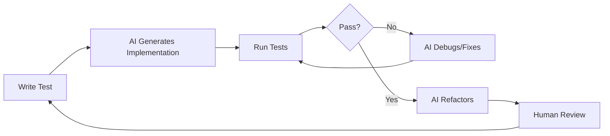

# Agent Systems Research: Architecture Patterns & Implementation Best Practices

**Research Date:** January 10, 2026
**Purpose:** Inform Hawk Agent architecture design with proven patterns from industry research

---

## Table of Contents

1. [Composable, Recursive Agent Systems](#1-composable-recursive-agent-systems)
2. [State Persistence Patterns for Agent Sessions](#2-state-persistence-patterns-for-agent-sessions)
3. [Human-in-the-Loop Integration Patterns](#3-human-in-the-loop-integration-patterns)
4. [Context Propagation Patterns](#4-context-propagation-patterns)
5. [TDD Workflow Automation for Agent Systems](#5-tdd-workflow-automation-for-agent-systems)
6. [Git Sandbox/Isolation Implementation Patterns](#6-git-sandboxisolation-implementation-patterns)
7. [Tool Calling & Function Dispatch Patterns](#7-tool-calling--function-dispatch-patterns)
8. [Agent Framework Comparison](#8-agent-framework-comparison)

---

## 1. Composable, Recursive Agent Systems

### Key Industry Trends (2025)

The AI landscape has shifted decisively from **monolithic language models to autonomous, task-solving AI agents** and **multi-agent architectures** designed for scale and enterprise deployment.

**Sources:**
- [AI Agent Architecture Patterns in 2025 - NexaiTech](https://nexaitech.com/multi-ai-agent-architecutre-patterns-for-scale/)
- [Inside the Machine: How Composable Agents Are Rewiring AI Architecture - Tribe.ai](https://www.tribe.ai/applied-ai/inside-the-machine-how-composable-agents-are-rewiring-ai-architecture-in-2025)
- [Architectural Patterns for the Agentic Era - Mulesoft](https://blogs.mulesoft.com/automation/architectural-patterns-for-the-agentic-era/)

### Core Architecture Concepts

#### 1. Architecture-as-Code (AaC)
- Agent ecosystems must be designed as code rather than static diagrams
- Enables operationalization in real-world environments
- Supports version control, testing, and deployment automation

#### 2. Composable Patterns
Composable patterns are specifically recommended when:
- Coordination across tools or contexts becomes unavoidable
- Delegation of tasks to specialized agents is needed
- Reasoning across multiple domains is required

**Industry Prediction:** Gartner predicts that by 2025, over **70% of organizations** will adopt some form of composable systems to stay competitive.

### Architecture Pattern Types

| Pattern | Description | Use Case |
|---------|-------------|----------|
| **Multi-Agent Systems** | Multiple specialized agents working in concert | Complex, multi-domain problems |
| **Sequential Pipeline** | Agents execute in ordered sequence | Well-defined workflows |
| **Concurrent Execution** | Parallel agent execution for speed | Independent subtasks |
| **Hierarchical Delegation** | Orchestrator delegates to worker agents | Large task decomposition |
| **Recursive/Agentic Systems** | Agents can spawn other agents | Dynamic problem solving |

### Key Publications

**Books:**
- [Agentic Design Patterns - Jimmy Song/PDF](https://assets.jimmysong.io/books/agentic-design-patterns-zh-20251011.pdf) - Comprehensive technical guide with flowcharts and code examples
- [Agentic Architectural Patterns (Amazon)](https://www.amazon.com/Agentic-Architectural-Patterns-Building-Multi-Agent-ebook/dp/B0FWJS2B31) - Focus on hierarchical multi-agent architecture
- [Generative AI Design Patterns - O'Reilly](https://www.oreilly.com/library/view/generative-ai-design/9798341622654/) - Codifies research and proven solutions

**Academic Papers:**
- [Agent Design Pattern Catalogue - arXiv](https://arxiv.org/html/2405.10467v2) - 17 architectural patterns with context and trade-off analysis
- [System Architecture for Agentic LLMs - UC Berkeley](https://www2.eecs.berkeley.edu/Pubs/TechRpts/2025/EECS-2025-5.pdf) - January 2025 technical report

### Recursive Delegation Patterns

**Key Resource:** [Dynamic Multi-agent Architecture Using Conversational Role Delegation](https://www.researchgate.net/publication/221419109_Dynamic_Multi-agent_Architecture_Using_Conversational_Role_Delegation)

**Pattern Characteristics:**
- Orchestrator agents delegate tasks to subordinate agents
- Hierarchical systems with layered delegation
- Dynamic role assignment based on task requirements
- Event-driven delegation patterns

**Implementation Considerations:**
1. **Clear role boundaries** - Each agent has well-defined responsibilities
2. **Delegation protocols** - Standardized handoff mechanisms
3. **Result aggregation** - Combining outputs from multiple agents
4. **Error propagation** - Handling failures in delegated tasks
5. **Communication overhead** - Minimizing agent-to-agent coordination costs

### Framework Implementations

**Google ADK (Agent Development Kit):**
- [Multi-Agent Systems Documentation](https://google.github.io/adk-docs/agents/multi-agents/)
- Composing multiple BaseAgent instances
- Built-in support for delegation patterns

**Confluent's Event-Driven Patterns:**
- [Four Design Patterns for Event-Driven Multi-Agent Systems](https://www.confluent.io/blog/event-driven-multi-agent-systems/)
- Layered agent architecture
- Higher-level agents delegate to lower-level specialists

---

## 2. State Persistence Patterns for Agent Sessions

### Framework Landscape

**Leading Frameworks:**
1. **Google ADK (Agent Development Kit)** - Built-in session state management
2. **Microsoft Azure AI Agent Architecture** - Enterprise-scale orchestration patterns
3. **AWS Agentic AI Frameworks** - Memory management for persistent state
4. **LangGraph** - Automatic state saving with checkpoint support

**Sources:**
- [Building Persistent Sessions with Google ADK - Medium](https://medium.com/@juanc.olamendy/building-persistent-sessions-with-google-adk-a-comprehensive-guide-c3bab191269d)
- [AI Agent Orchestration Patterns - Azure Architecture Center](https://learn.microsoft.com/en-us/azure/architecture/aipatterns/ai-agent-design-patterns)
- [Agentic AI frameworks - AWS Prescriptive Guidance](https://docs.aws.amazon.com/prescriptive-guidance/latest/agentic-ai-frameworks/frameworks.html)
- [State Management - Agent Development Kit](https://google.github.io/adk-docs/sessions/state/)
- [Agent Frameworks Comparison - Arize](https://arize.com/ai-agents/agent-frameworks/)

### Core Persistence Patterns

#### 1. Session-Based Persistence
**Characteristics:**
- Temporary state storage during active sessions
- Dictionary/Map-based key-value storage
- Automatic state persistence after each operation

**Implementation (Google ADK):**
```python
# ADK provides session.state as a dictionary
session.state["user_context"] = context_data
# Automatically persisted after each agent step
```

#### 2. Long-Term Memory
**Characteristics:**
- Persistent storage for extended context retention
- Enables agents to recall information across conversations
- Often uses vector databases or specialized memory systems

**Frameworks:**
- LangGraph with vector stores
- Zep (memory platform for AI agents)
- Mem0

#### 3. Stateful Memory Management
**Characteristics:**
- Maintains conversation history and context
- Supports session resumption and checkpointing
- Context sharing between multiple agents

**Key Resource:** [Chapter 8: Memory Management - Agentic Design Patterns](https://github.com/ginobefun/agentic-design-patterns-cn/blob/main/14-Chapter-08-Memory-Management.md)

### State Management Approaches

| Approach | Description | Trade-offs |
|----------|-------------|------------|
| **Single Dictionary** | Unified state object | Simple, but can become unwieldy |
| **Partitioned State** | Separate state domains | More complex, better organization |
| **Event Sourcing** | State derived from events | Excellent audit trail, complex queries |
| **Checkpoint-Based** | Periodic state snapshots | Good for recovery, potential data loss |

### Design Considerations

**From [Context Management for Agentic AI - Medium](https://medium.com/@hungry.soul/context-management-a-practical-guide-for-agentic-ai-74562a33b2a5):**

1. **Coherence Duration**
   - How long can an agent maintain coherent conversation?
   - Balances context window limits with conversation continuity

2. **Data Retrieval and Merging**
   - How session services handle state updates
   - Conflict resolution for concurrent updates

3. **Orchestration Logic**
   - Managing state across different agent coordination patterns
   - State synchronization between agents

4. **Enterprise Scalability**
   - Handling state management at scale
   - Performance considerations for large state objects

### Implementation Best Practices

**From [Azure AI Agent Design Patterns](https://learn.microsoft.com/en-us/azure/architecture/patterns/ai/agent-design-patterns):**

1. **Automatic Persistence**
   - Save state after each operation
   - Minimize data loss on interruptions

2. **Session Resumption**
   - Support checkpoint-based recovery
   - Graceful handling of session timeouts

3. **Context Sharing**
   - Define clear protocols for inter-agent communication
   - Use shared state stores for coordination

4. **State Versioning**
   - Track state changes over time
   - Enable rollback to previous states

### Memory Systems Beyond Context Windows

**Sources:**
- [Agent Memory Systems: Beyond Context Windows - Cisco DevNet](https://community.cisco.com/t5/devnet-general-blogs/agent-memory-systems-beyond-context-windows/ba-p/5352003)
- [A comprehensive review of AI Memory systems - Pieces.app](https://pieces.app/blog/best-ai-memory-systems)
- [Mem0 Research Paper - arXiv](https://arxiv.org/pdf/2504.19413)

**Key Trends in 2025:**
- **Persistent memory architectures** moving beyond simple context windows
- **Externalized memory systems** using file systems and structured storage
- **Memory platforms** (like Zep) specifically designed for AI agents
- **Active context engineering** as a production practice

---

## 3. Human-in-the-Loop Integration Patterns

### Comprehensive Resources

**Key Documentation:**
- [Human-in-the-Loop for AI Agents: Best Practices - Permit.io](https://www.permit.io/blog/human-in-the-loop-for-ai-agents-best-practices-frameworks-use-cases-and-demo)
- [Chapter 13: Human-in-the-Loop - Agentic Design Patterns](https://github.com/ginobefun/agentic-design-patterns-cn/blob/main/19-Chapter-13-Human-in-the-Loop.md)
- [Build a Human-in-the-loop Agent - Cloudflare](https://developers.cloudflare.com/agents/guides/human-in-the-loop/)
- [Human-in-the-Loop AI Agent with LangGraph - IBM](https://www.ibm.com/think/tutorials/human-in-the-loop-ai-agent-langgraph-watsonx-ai)
- [Developer's guide to multi-agent patterns in ADK - Google](https://developers.googleblog.com/developers-guide-to-multi-agent-patterns-in-adk/)

### Core HITL Patterns

#### 1. Approval Gates
**Description:** Agents pause execution at critical decision points for human approval

**Use Cases:**
- Destructive operations (file deletion, git commits)
- External communications (sending emails, API calls)
- Security-sensitive actions
- Financial transactions

**Implementation Pattern:**
```python
def execute_with_approval(agent, action):
    proposal = agent.propose_action(action)
    human_response = request_human_approval(proposal)
    if human_response.approved:
        return agent.execute(action)
    else:
        return agent.handle_rejection(human_response.feedback)
```

#### 2. Feedback Loops
**Description:** Continuous human feedback to improve agent behavior

**Use Cases:**
- Quality assurance
- Model training and fine-tuning
- Performance optimization
- Error correction

**Best Practices from [TryHavana](https://www.tryhavana.com/blog/human-loop-ai-agents-design):**
- Clear handoff protocols
- User control throughout the process
- Actionable feedback mechanisms
- Learning from human interventions

#### 3. Collaborative Problem Solving
**Description:** Agents and humans work together on complex tasks

**Characteristics:**
- Agent handles routine aspects
- Human provides strategic guidance
- Dynamic task reassignment
- Complementary strengths

### Implementation Frameworks

**LangGraph:**
- Native support for human-in-the-loop workflows
- Pause-and-resume functionality
- Checkpoint-based state preservation

**IBM Watsonx.ai:**
- HITL as a feedback mechanism
- Integration with LangGraph
- Enterprise-grade implementation

**Google ADK:**
- Multi-agent patterns with human oversight
- Sequential pipeline patterns
- Handoff mechanisms

### Design Best Practices

**From [Permit.io Best Practices](https://www.permit.io/blog/human-in-the-loop-for-ai-agents-best-practices-frameworks-use-cases-and-demo):**

1. **Clear Handoff Protocols**
   - Unambiguous communication when agent needs human input
   - Structured proposal formats
   - Response templates

2. **User Control**
   - Humans can override agent decisions
   - Ability to modify agent proposals
   - Emergency stop mechanisms

3. **Feedback Integration**
   - Agents learn from human corrections
   - Feedback is captured and structured
   - Continuous improvement loops

4. **Transparency**
   - Clear explanation of agent reasoning
   - Visibility into proposed actions
   - Audit trail of human interventions

### HITL Use Cases

| Use Case | Pattern | Implementation |
|----------|---------|----------------|
| **Code Review** | Approval Gate | Agent proposes changes, human approves |
| **Debugging** | Collaborative | Agent suggests fixes, human validates |
| **Research** | Feedback Loop | Human guides agent focus areas |
| **Content Creation** | Collaborative | Agent drafts, human refines |
| **Deployment** | Approval Gate | Agent prepares, human approves |

### Video Resources

- [Human-in-the-Loop for AI Agents: Patterns and Best Practices - YouTube](https://www.youtube.com/watch?v=YCFGjLjNOyw)
- [Agents with Human in the Loop: Everything You Need - Dev.to](https://dev.to/camelai/agents-with-human-in-the-loop-everything-you-need-to-know-3fo5)

---

## 4. Context Propagation Patterns

### React/Redux-Inspired Patterns

**Core Resources:**
- [React (Context API + Hooks) Redux Pattern - Dev.to](https://dev.to/iliutastoica/react-context-api-hooks-redux-pattern-2p5l)
- [React Context: Dependency injection, not state management - Testdouble](https://testdouble.com/insights/react-context-for-dependency-injection-not-state-management)
- [Four patterns for global state with React hooks - Axlight Blog](https://blog.axlight.com/posts/four-patterns-for-global-state-with-react-hooks-context-or-redux/)
- [Redux Fundamentals, Part 7: Standard Redux Patterns](https://redux.js.org/tutorials/fundamentals/part-7-standard-patterns)
- [React-Redux Roadmap: v6, Context, Subscriptions - GitHub](https://github.com/reduxjs/react-redux/issues/1177)

### Key Insight: React-Redux Uses Context Internally

**From Redux maintainer Mark Erikson:**
> "React-Redux is just a wrapper around React context"

This has important implications for agent systems:
- **Context propagation** is fundamental to how React-Redux v6+ works
- **Dependency injection pattern** using Context is valuable for agent systems
- **Avoiding unnecessary re-renders** through context value destructuring

### Context Propagation Patterns for Agents

#### 1. Centralized Store Pattern
**Inspired by:** Redux single source of truth

**Application to Agents:**
```python
class AgentContext:
    def __init__(self):
        self.state = {}
        self.subscribers = []

    def dispatch(self, action):
        # Update state
        new_state = reducer(self.state, action)
        self.state = new_state
        # Notify subscribers
        for subscriber in self.subscribers:
            subscriber(new_state)

    def subscribe(self, callback):
        self.subscribers.append(callback)
```

**Benefits:**
- Single source of truth
- Predictable state updates
- Easy debugging and time-travel
- Clear data flow

**Trade-offs:**
- Can become bottleneck
- More boilerplate
- Learning curve

#### 2. Multiple Contexts Pattern
**Inspired by:** React Context API with multiple contexts

**Application to Agents:**
```python
# Domain-specific contexts
tool_context = AgentContext()
memory_context = AgentContext()
task_context = AgentContext()

# Agents subscribe to relevant contexts
def specialist_agent(task):
    tool_context.use(lambda tools: execute_with_tools(task, tools))
```

**Benefits:**
- Domain separation
- Targeted updates
- Better performance (fewer re-renders)

**Trade-offs:**
- Context synchronization complexity
- Duplicate state risk
- More complex architecture

#### 3. Dependency Injection Pattern
**Inspired by:** React Context for dependency injection

**Application to Agents:**
```python
class AgentDependencies:
    def __init__(self, tools, memory, logger):
        self.tools = tools
        self.memory = memory
        self.logger = logger

# Inject dependencies into agents
def create_agent(deps):
    return Agent(
        tools=deps.tools,
        memory=deps.memory,
        logger=deps.logger
    )
```

**Benefits:**
- Clear dependencies
- Easy testing (mock dependencies)
- Flexible configuration

**Trade-offs:**
- More setup code
- Dependency management complexity

### Context Window Management

**Sources:**
- [Context Windows Are the New Memory Management - Medium](https://medium.com/@davidmatousek/context-windows-are-the-new-memory-management-1a1aa4d600da)
- [Mastering Claude's Context Window: A 2025 Deep Dive - SparkCo](https://sparkco.ai/blog/mastering-claudes-context-window-a-2025-deep-dive)
- [Context Engineering for AI Agents: Lessons from Building Manus - Manus.im](https://manus.im/blog/Context-Engineering-for-AI-Agents-Lessons-from-Building-Manus)

**Best Practices:**

1. **Context Quality Over Quantity**
   - Curate relevant information
   - Remove redundant data
   - Structure for easy retrieval

2. **Hierarchical Context**
   - Global context (always present)
   - Session context (conversation-level)
   - Task context (specific operation)

3. **Active Context Engineering**
   - Dynamically load context as needed
   - External memory for large datasets
   - File systems as structured memory

4. **Context Compression**
   - Summarization of historical context
   - Token-efficient representations
   - Selective inclusion

### Multi-Agent Context Sharing

**From [Google's Context-Aware Multi-Agent Framework](https://developers.googleblog.com/architecting-efficient-context-aware-multi-agent-framework-for-production/):**

**Patterns:**

1. **Shared Context Store**
   - All agents read from/write to central context
   - Requires careful synchronization

2. **Context Propagation**
   - Context passed between agents
   - Clear handoff protocols

3. **Partitioned Context**
   - Each agent has private context
   - Shared context for coordination

4. **Context Projection**
   - Agents see relevant subset of full context
   - Reduces cognitive load and token usage

### Implementation Framework

**Google ADK Approach:**
```python
# Define context schema
@dataclass
class AgentContext:
    user_preferences: Dict[str, Any]
    conversation_history: List[Message]
    current_task: Task
    available_tools: List[Tool]

# Pass context to agents
def execute_agent(agent, context):
    result = agent.run(context)
    # Update context with results
    context.conversation_history.append(result)
    return result
```

---

## 5. TDD Workflow Automation for Agent Systems

### Comprehensive Resources

**Key Sources:**
- [AI Agents, meet Test Driven Development - Latent Space](https://www.latent.space/p/anita-tdd)
- [AI Code Assistants Are Revolutionizing Test-Driven Development - Qodo](https://www.qodo.ai/blog/ai-code-assistants-test-driven-development/)
- [Test-Driven Development with AI - Builder.io](https://www.builder.io/blog/test-driven-development-ai)
- [Test driven development with AI Agents - Flowhunt](https://www.flowhunt.io/blog/test-driven-development-with-ai-agents/)
- [TDD, AI agents and coding with Kent Beck - Pragmatic Engineer](https://newsletter.pragmaticengineer.com/p/tdd-ai-agents-and-coding-with-kent)

### Core Concept: AI-Native TDD

**Five Stages of TDD-Based AI Development (from Latent Space):**

1. **Specification as Code**
   - Tests define expected behavior
   - Specifications are executable
   - Clear acceptance criteria

2. **Red-Green-Refactor with AI**
   - AI helps write failing tests
   - AI generates implementation
   - AI refactors for quality

3. **Continuous Validation**
   - Automated test execution
   - Rapid feedback loops
   - Regression prevention

4. **Test-Driven Agent Development**
   - Agents themselves are tested
   - Behavior verification
   - Edge case coverage

5. **AI-Assisted Test Generation**
   - AI generates test cases
   - Exploratory testing
   - Coverage analysis

### TDD Patterns for Agent Systems

#### 1. Behavior-Driven Testing
**Focus:** Test what the agent should do, not how

**Example:**
```python
def test_agent_should_summarize_document():
    agent = SummarizerAgent()
    document = load_test_document()
    result = agent.summarize(document)

    assert result.length < 1000  # Concise
    assert result.contains_key_points()  # Comprehensive
    assert result.readability_score > 8  # Clear
```

#### 2. Tool-Call Verification
**Focus:** Verify agent uses tools correctly

**Example:**
```python
def test_agent_calls_git_on_deploy():
    mock_git = MockGit()
    agent = DeployAgent(git=mock_git)

    agent.deploy(feature_branch)

    mock_git.assert_called_with(
        "checkout", "main"
    )
    mock_git.assert_called_with(
        "merge", feature_branch
    )
```

#### 3. Conversation Flow Testing
**Focus:** Test multi-turn interactions

**Example:**
```python
def test_debugging_conversation_flow():
    agent = DebuggingAgent()

    # User reports error
    response1 = agent.handle("I get an error")
    assert "details" in response1.lower()

    # User provides details
    response2 = agent.handle("Error: null pointer")
    assert "solution" in response2.lower()

    # User confirms fix
    response3 = agent.handle("That worked!")
    assert "great" in response3.lower()
```

#### 4. Memory/Context Testing
**Focus:** Verify agent remembers context

**Example:**
```python
def test_agent_remembers_user_preferences():
    agent = AssistantAgent()

    agent.set_preference("language", "Python")
    agent.set_preference("style", "functional")

    code = agent.generate_code("sort a list")

    assert "def" in code  # Python
    assert "lambda" in code or "map" in code  # Functional
```

### Test-Driven Agentic Development

**From [Medium: Test-Driven Agentic Development](https://medium.com/@JeffInUptown/test-driven-agentic-development-how-tdd-and-specification-as-code-can-enable-autonomous-coding-6b1b4b7dd816):**

**Key Principles:**

1. **Specification as Code**
   - Tests are the primary specification
   - Executable requirements
   - Living documentation

2. **Incremental Development**
   - Small, testable increments
   - Continuous validation
   - Rapid feedback

3. **Autonomous Coding**
   - AI generates implementation from tests
   - Human reviews and refines
   - Iterative improvement

### TDD for AI System Architecture

**From [Galileo.ai: TDD for AI System Architecture](https://galileo.ai/blog/tdd-ai-system-architecture):**

**Benefits:**
- Ensures robust architecture
- Enables modular testing
- Facilitates refactoring
- Catches integration issues early

**Patterns:**

1. **Unit Tests for Individual Agents**
   - Test agent logic in isolation
   - Mock dependencies
   - Verify decision-making

2. **Integration Tests for Multi-Agent Systems**
   - Test agent interactions
   - Verify communication protocols
   - Test delegation patterns

3. **End-to-End Tests for Workflows**
   - Test complete user journeys
   - Verify system behavior
   - Test edge cases

4. **Performance Tests**
   - Measure response times
   - Test scalability
   - Resource utilization

### AI Agents in Test Automation

**From [Auxis: Agentic AI in Test Automation](https://www.auxis.com/why-agentic-ai-in-test-automation-is-the-future-of-testing/):**

**Agentic AI uses intelligent, self-learning agents to:**
- Automate test case generation
- Execute exploratory testing
- Analyze test results
- Suggest improvements

**TDD Workflow with AI Agents:**



### Kent Beck on TDD with AI

**From [Pragmatic Engineer Newsletter](https://newsletter.pragmaticengineer.com/p/tdd-ai-agents-and-coding-with-kent):**

> "TDD is a 'superpower' when working with AI agents for development"

**Key Insights:**
- TDD provides guardrails for AI code generation
- Tests guide AI toward correct implementation
- Human focuses on high-level design, AI on implementation
- Rapid iteration cycle

### Implementation Framework

**Example TDD Workflow:**

```python
# 1. Write test (Red)
def test_agent_decomposes_task():
    agent = TaskAgent()
    task = ComplexTask()

    subtasks = agent.decompose(task)

    assert len(subtasks) > 1
    assert all(is_executable(t) for t in subtasks)

# 2. Run test (fails)
# 3. AI generates implementation (Green)
class TaskAgent:
    def decompose(self, task):
        return task.break_down()

# 4. Refactor with AI (Refactor)
class TaskAgent:
    def decompose(self, task):
        # AI suggests improvements
        return sorted(
            task.break_down(),
            key=lambda t: t.priority
        )
```

---

## 6. Git Sandbox/Isolation Implementation Patterns

### Git Worktree & Sparse Checkout

**Key Resources:**
- [How to Use Git Worktree for Claude Code Development - Medium](https://medium.com/@naveensky/how-to-use-git-worktree-for-claude-code-development-43dfbd554b21) - Combines worktree with sparse checkout for "laser-focused AI environments"
- [git-worktree Documentation](https://git-scm.com/docs/git-worktree) - Official documentation for multiple working trees
- [git-sparse-checkout Documentation](https://git-scm.com/docs/git-sparse-checkout) - Official sparse checkout commands

### Pattern: Multiple Working Trees

**Concept:** Maintain multiple working directories from a single repository

**Use Cases:**
- Parallel development in isolation
- Testing different approaches simultaneously
- Safe agent experimentation
- Code review without switching branches

**Implementation:**

```bash
# Create additional working tree
git worktree add ../feature-sandbox feature-branch

# Work in isolation
cd ../feature-sandbox
# Agent can experiment safely

# Remove when done
git worktree remove ../feature-sandbox
```

**Benefits:**
- No branch switching overhead
- True isolation of changes
- Simultaneous multi-branch work
- Easy cleanup

### Pattern: Sparse Checkout

**Concept:** Work with only a subset of repository files

**Use Cases:**
- Focus agent on specific modules
- Reduce context window overhead
- Faster operations in large repos
- Minimize distraction

**Implementation:**

```bash
# Enable sparse checkout
git sparse-checkout init

# Define patterns
git sparse-checkout set src/agents/*.py
git sparse-checkout add tests/test_*.py

# Or use cone mode for directories
git sparse-checkout set --cone src/agents
```

**Advanced Patterns:**

```bash
# Exclude specific directories
git sparse-checkout set /*
git sparse-checkout disable node_modules/
git sparse-checkout disable build/

# Worktree + Sparse Checkout combination
git worktree add ../minimal-sandbox --sparse
git -C ../minimal-sandbox sparse-checkout set --cone src/agents
```

### Pattern: Phantom/Sandbox Git

**Concept:** Create isolated Git environments for testing

**Sources:**
- [Isolation and Beyond: Challenges for System Security - UT Austin](https://www.cs.utexas.edu/~witchel/pubs/hunt19hotos-isolation.pdf)
- [A Fine-Grained Sandbox for Deno Subprocesses - ACM](https://dl.acm.org/doi/10.1145/3579856.3595799)

**Implementation Approaches:**

#### 1. Temporary Repositories
```bash
# Create temporary clone
TMPDIR=$(mktemp -d)
git clone --depth=1 . $TMPDIR/phantom-repo

# Agent works in temp directory
cd $TMPDIR/phantom-repo
# ... agent operations ...

# Cleanup
rm -rf $TMPDIR
```

#### 2. Git Worktree Isolation
```bash
# Create isolated worktree
git worktree add ../sandbox --detach

# Create test branch in isolation
cd ../sandbox
git checkout --orphan test-experiment

# Agent experiments safely
# ... agent operations ...

# Cleanup
git worktree remove ../sandbox
```

#### 3. Containerized Git
```bash
# Run Git in container
docker run -v $(pwd):/repo -w /repo git bash
# Agent operates in containerized environment
```

### Isolation Techniques Comparison

| Technique | Isolation Level | Overhead | Use Case |
|-----------|----------------|----------|----------|
| **Git Worktree** | Directory | Low | Parallel development |
| **Sparse Checkout** | Filesystem | Very Low | Focus on specific files |
| **Temporary Clone** | Repository | Medium | Complete isolation |
| **Containerized Git** | Process | High | Maximum isolation |
| **Chroot Jail** | Filesystem | Medium | Unix isolation |

### Best Practices for Agent Git Operations

**From [Claude Code Development with Git Worktree](https://medium.com/@naveensky/how-to-use-git-worktree-for-claude-code-development-43dfbd554b21):**

1. **Create Agent-Specific Worktrees**
   ```bash
   git worktree add ../agent-sandbox -b agent-work
   ```

2. **Use Sparse Checkout for Focus**
   ```bash
   cd ../agent-sandbox
   git sparse-checkout set --cone src/agents tests/
   ```

3. **Implement Automatic Cleanup**
   ```bash
   # On agent completion
   git worktree remove ../agent-sandbox
   ```

4. **Track Worktree Status**
   ```bash
   git worktree list
   git worktree prune
   ```

### Security Considerations

**From Research on Sandboxing Techniques:**

1. **File System Isolation**
   - Restrict agent to specific directories
   - Prevent access to sensitive files
   - Use chroot or containers

2. **Git Operation Sandboxing**
   - Wrap Git commands in permission checks
   - Audit Git operations
   - Restrict destructive commands

3. **Network Isolation**
   - Prevent unauthorized push/pull
   - Control remote access
   - Use SSH key management

### Integration with Agent Systems

**Pattern: Git-Aware Agent**

```python
class GitAwareAgent:
    def __init__(self, repo_path):
        self.repo = git.Repo(repo_path)
        self.sandbox = None

    def create_sandbox(self):
        # Create worktree
        self.sandbox = self.repo.worktree.create(
            path="../agent-sandbox",
            branch="agent-work"
        )
        return self.sandbox

    def work_in_sandbox(self, task):
        with self.sandbox:
            # Agent operations in isolation
            result = self.execute(task)
            return result

    def cleanup(self):
        if self.sandbox:
            self.sandbox.remove()
```

---

## 7. Tool Calling & Function Dispatch Patterns

### Comprehensive 2025 Resources

**Key Sources:**
- [How Tools Are Called in AI Agents: Complete 2025 Guide - Medium](https://medium.com/@sayalisureshkumbhar/how-tools-are-called-in-ai-agents-complete-2025-guide-with-examples-42dcdfe6ba38)
- [Function Calling and Tool Use: Enabling Practical AI Agent - Medium](https://mbrenndoerfer.com/writing/function-calling-tool-use-practical-ai-agents)
- [Mastering Tool Calling: Best Practices for 2025 - SparkCo](https://sparkco.ai/blog/mastering-tool-calling-best-practices-for-2025)
- [Writing effective tools for AI agents - Anthropic Engineering](https://www.anthropic.com/engineering/writing-tools-for-agents)
- [Tool Use in Agentic AI: A 2025 Systems Overview - Samir Amana](https://samiranama.com/posts/Tool-Use-in-Agentic-AI-A-2025-Systems-Overview/)

### Core Tool Calling Flow

**Standard 5-Step Process (from OpenAI docs):**

1. **Request with Tools** - Send message with tool definitions
2. **Receive Tool Calls** - Model requests tool usage
3. **Execute Tools** - Run requested functions
4. **Submit Outputs** - Return results to model
5. **Generate Response** - Model produces final answer

**From [OpenAI Function Calling Documentation](https://platform.openai.com/docs/guides/function-calling):**

```python
# Step 1: Define tools
tools = [{
    "type": "function",
    "function": {
        "name": "get_weather",
        "description": "Get current weather",
        "parameters": {
            "type": "object",
            "properties": {
                "location": {"type": "string"}
            },
            "required": ["location"]
        }
    }
}]

# Step 2: Request with tools
response = client.chat.completions.create(
    model="gpt-4",
    messages=[{"role": "user", "content": "What's the weather in SF?"}],
    tools=tools
)

# Step 3: Execute tool calls
tool_calls = response.choices[0].message.tool_calls
results = [execute_tool(call) for call in tool_calls]

# Step 4: Submit outputs
final_response = client.chat.completions.create(
    model="gpt-4",
    messages=[
        {"role": "user", "content": "What's the weather in SF?"},
        response.choices[0].message,
        *[{"role": "tool", "tool_call_id": r.id, "content": r.result}
          for r in results]
    ]
)
```

### Tool Design Best Practices

**From [Anthropic: Writing Effective Tools](https://www.anthropic.com/engineering/writing-tools-for-agents):**

#### 1. Clear Descriptions
```python
# Bad
{
    "name": "git",
    "description": "Run git command",
    "parameters": {"command": {"type": "string"}}
}

# Good
{
    "name": "git_commit",
    "description": "Create a git commit with a message",
    "parameters": {
        "message": {
            "type": "string",
            "description": "Commit message describing changes"
        },
        "files": {
            "type": "array",
            "items": {"type": "string"},
            "description": "List of files to commit (optional, defaults to all staged)"
        }
    }
}
```

#### 2. Granular Tools
```python
# Instead of one generic tool
{"name": "execute_shell", "description": "Run any command"}

# Use specific, focused tools
{"name": "git_status", "description": "Show working tree status"}
{"name": "git_add", "description": "Stage files for commit"}
{"name": "git_commit", "description": "Create commit"}
```

#### 3. Explicit Parameters
```python
{
    "name": "file_search",
    "description": "Search for files matching pattern",
    "parameters": {
        "pattern": {
            "type": "string",
            "description": "Glob pattern (e.g., '*.py', 'src/**/*.ts')"
        },
        "path": {
            "type": "string",
            "description": "Directory to search (defaults to current directory)",
            "default": "."
        },
        "max_results": {
            "type": "integer",
            "description": "Maximum number of results to return",
            "default": 100
        }
    }
}
```

### Tool Dispatch Patterns

#### 1. Direct Dispatch
```python
class ToolDispatcher:
    def __init__(self):
        self.tools = {
            "git_status": self.git_status,
            "git_add": self.git_add,
            "git_commit": self.git_commit,
        }

    def dispatch(self, tool_name, parameters):
        if tool_name in self.tools:
            return self.tools[tool_name](**parameters)
        else:
            raise ValueError(f"Unknown tool: {tool_name}")
```

#### 2. Router Pattern
```python
class ToolRouter:
    def __init__(self):
        self.routes = {}

    def register(self, name, tool):
        self.routes[name] = tool

    def route(self, tool_call):
        tool = self.routes.get(tool_call.name)
        if tool:
            return tool.execute(tool_call.parameters)
        else:
            return self.handle_unknown(tool_call)
```

#### 3. Chain Pattern
```python
class ToolChain:
    def __init__(self, tools):
        self.tools = tools

    def execute(self, tool_calls):
        results = []
        context = {}

        for call in tool_calls:
            # Pass results from previous tools
            result = self.tools[call.name].execute(
                call.parameters,
                context=context
            )
            results.append(result)
            context[call.name] = result

        return results
```

### Error Handling & Retry Logic

**From [AI Function Calling in 2025](https://www.kidsil.net/2025/07/ai-function-calling/):**

```python
class ResilientToolExecutor:
    def __init__(self, max_retries=3):
        self.max_retries = max_retries

    def execute_with_retry(self, tool_call):
        for attempt in range(self.max_retries):
            try:
                result = tool_call.execute()
                return result
            except TemporaryError as e:
                if attempt == self.max_retries - 1:
                    raise
                time.sleep(2 ** attempt)  # Exponential backoff
            except PermanentError as e:
                # Don't retry permanent errors
                raise
```

### Side-Effect Management

**From [Tool Use in Agentic AI: 2025 Systems Overview](https://samiranama.com/posts/Tool-Use-in-Agentic-AI-A-2025-Systems-Overview/):**

**Key Insight:** Tools should be side-effect conscious, especially for agents using the TAO (Think-Act-Observe) loop that might call tools multiple times.

**Patterns:**

1. **Idempotent Tools**
   ```python
   def create_file(path, content):
       # Check if exists first
       if os.path.exists(path):
           return {"status": "exists", "path": path}
       # Then create
       with open(path, 'w') as f:
           f.write(content)
       return {"status": "created", "path": path}
   ```

2. **Dry-Run Mode**
   ```python
   class GitTool:
       def __init__(self, dry_run=False):
           self.dry_run = dry_run

       def commit(self, message):
           if self.dry_run:
               return f"Would commit: {message}"
           else:
               return actual_git.commit(message)
   ```

3. **Transactional Operations**
   ```python
   class TransactionalTool:
       def __init__(self):
           self.operations = []

       def prepare(self, operation):
           self.operations.append(operation)

       def commit(self):
           results = []
           for op in self.operations:
               results.append(op.execute())
           return results

       def rollback(self):
           # Undo all operations
           pass
   ```

### MCP (Model Context Protocol)

**From [Mastering Tool Calling: Best Practices for 2025](https://sparkco.ai/blog/mastering-tool-calling-best-practices-for-2025):**

**MCP** facilitates smooth communication between AI agents and tools.

**Key Features:**
- Standardized tool interface
- Type-safe parameter passing
- Consistent error handling
- Discoverable tool capabilities

**Implementation Pattern:**

```python
# Define MCP-compliant tool
@mcp_tool
def git_status(repo_path: str) -> Dict[str, Any]:
    """
    Get git repository status

    Args:
        repo_path: Path to git repository

    Returns:
        Dictionary with modified, added, deleted files
    """
    repo = git.Repo(repo_path)
    return {
        "modified": [item.a_path for item in repo.index.diff(None)],
        "staged": [item.a_path for item in repo.index.diff("HEAD")],
        "untracked": repo.untracked_files
    }
```

### Tool Calling in Agent Frameworks

**LangChain:**
- [LangChain AI Agents: Complete Implementation Guide 2025](https://www.digitalapplied.com/blog/langchain-ai-agents-guide-2025)
- Tools as the interface between agents and external systems
- Built-in tool library with custom tool support

**LangGraph:**
- Explicit control over tool usage
- State management for tool results
- Conditional routing based on tool outputs

**CrewAI:**
- Role-based tool assignment
- Tool delegation patterns
- Team-oriented tool collaboration

---

## 8. Agent Framework Comparison

### Comprehensive Comparisons

**Key Sources:**
- [CrewAI vs LangGraph vs AutoGen: Choosing the Right Framework - DataCamp](https://www.datacamp.com/tutorial/crewai-vs-langgraph-vs-autogen)
- [OpenAI Agents SDK vs LangGraph vs AutoGen vs CrewAI - Composio](https://composio.dev/blog/openai-agents-sdk-vs-langgraph-vs-autogen-vs-crewai)
- [Top AI Agent Frameworks in 2025 - Medium](https://medium.com/@iamanraghuvanshi/agentic-ai-3-top-ai-agent-frameworks-in-2025-langchain-autogen-crewai-beyond-2fc3388e7dec)
- [AI Agent Frameworks: A Detailed Comparison - Turing](https://www.turing.com/resources/ai-agent-frameworks)

### Framework Matrix

| Framework | Focus | Strengths | Weaknesses | Best For |
|-----------|-------|-----------|------------|----------|
| **LangGraph** | Workflow orchestration | Explicit state machine control, visual graphs | Learning curve | Complex, multi-step workflows |
| **AutoGen** | Multi-agent collaboration | Role-playing, open-ended problem solving | Microsoft ecosystem | Complex reasoning tasks |
| **CrewAI** | Role-based execution | Team-oriented, task delegation | Less flexible | Clear role separation |
| **LangChain** | Tool integration | Large ecosystem, many tools | Can be overwhelming | Tool-heavy applications |
| **Google ADK** | Enterprise scale | Production-ready, state management | Newer, smaller community | Enterprise deployments |
| **OpenAI Agents SDK** | OpenAI integration | Native GPT-4 support | Vendor lock-in | OpenAI-centric apps |

### Detailed Framework Analysis

#### LangGraph
**From [DataCamp Comparison](https://www.datacamp.com/tutorial/crewai-vs-langgraph-vs-autogen):**

**Key Features:**
- Flowchart-style execution control
- Explicit state machine management
- Built-in checkpointing and persistence
- Support for human-in-the-loop

**Best For:**
- Deterministic workflows
- Complex state management
- Visual debugging
- Production systems

**Example Pattern:**
```python
from langgraph.graph import StateGraph

workflow = StateGraph(AgentState)
workflow.add_node("researcher", research_agent)
workflow.add_node("writer", writer_agent)
workflow.add_edge("researcher", "writer")
workflow.set_entry_point("researcher")

app = workflow.compile()
```

#### AutoGen
**From [Microsoft AutoGen Documentation](https://microsoft.github.io/autogen/):**

**Key Features:**
- Multi-agent role-playing
- Code generation and execution
- Conversational agent interaction
- Group chat patterns

**Best For:**
- Open-ended problem solving
- Code generation tasks
- Research and analysis
- Complex reasoning

**Example Pattern:**
```python
assistant = AssistantAgent("assistant", llm_config)
user_proxy = UserProxyAgent("user_proxy")

user_proxy.initiate_chat(
    assistant,
    message="Solve this coding problem"
)
```

#### CrewAI
**From [CrewAI Documentation](https://docs.crewai.com/):**

**Key Features:**
- Role-based agent teams
- Task delegation patterns
- Hierarchical organization
- Clear process flows

**Best For:**
- Well-defined roles
- Task decomposition
- Team collaboration
- Business processes

**Example Pattern:**
```python
researcher = Agent(
    role="Researcher",
    goal="Find information",
    backstory="Expert researcher"
)

writer = Agent(
    role="Writer",
    goal="Create content",
    backstory="Expert writer"
)

crew = Crew(
    agents=[researcher, writer],
    tasks=[research_task, writing_task]
)
```

#### Google ADK
**From [Google ADK Documentation](https://google.github.io/adk-docs/):**

**Key Features:**
- Built-in state management
- Session persistence
- Multi-agent composition
- Enterprise-ready

**Best For:**
- Enterprise applications
- Production systems
- Google Cloud integration
- Scalable deployments

**Example Pattern:**
```python
@agent.agent_class
class MyAgent(agent.BaseAgent):
    async def run(self, request: agent.AgentRequest) -> agent.AgentResponse:
        # Access state
        context = request.session.state.get("context")
        # Process
        result = await self.process(context)
        # Update state
        request.session.state["result"] = result
        return agent.AgentResponse(result)
```

### Framework Selection Criteria

**From [Complete Guide to Choosing an AI Agent Framework - Langflow](https://www.langflow.org/blog/the-complete-guide-to-choosing-an-ai-agent-framework-in-2025):**

#### 1. Complexity Requirements
- **Simple workflows:** LangChain, CrewAI
- **Complex state management:** LangGraph, Google ADK
- **Open-ended reasoning:** AutoGen

#### 2. Team Expertise
- **Python-heavy:** LangChain, LangGraph, CrewAI
- **Microsoft stack:** AutoGen
- **Google Cloud:** Google ADK
- **TypeScript:** Vercel AI SDK

#### 3. Integration Needs
- **OpenAI models:** OpenAI Agents SDK
- **Multiple providers:** LangChain, LangGraph
- **Enterprise systems:** Google ADK, AWS frameworks

#### 4. Operational Concerns
- **Debugging:** LangGraph (visual), LangChain (tracing)
- **Monitoring:** LangSmith, Weights & Biases
- **Deployment:** All support containerization
- **Scalability:** Google ADK, AWS frameworks

### Emerging Trends (2025)

**From [AI Agent Architecture Patterns in 2025](https://nexaitech.com/multi-ai-agent-architecutre-patterns-for-scale/):**

1. **Framework Interoperability**
   - Standards for agent communication
   - Cross-framework tool sharing
   - Universal agent protocols

2. **Agent Composition Primitives**
   - Standard composition patterns
   - Reusable agent components
   - Agent libraries/marketplaces

3. **Production-Ready Features**
   - Built-in monitoring
   - Automatic scaling
   - Cost optimization
   - Error recovery

4. **Enterprise Integration**
   - IAM/Authentication
   - Audit logging
   - Compliance features
   - Governance controls

### Recommendation for Hawk Agent

**Based on Research:**

**Primary Framework:** **LangGraph**
- Explicit state management (matches PRD requirements)
- Built-in checkpointing (matches session persistence)
- Human-in-the-loop support (matches HITL patterns)
- Visual debugging (matches observability needs)
- Production-ready (matches reliability requirements)

**Secondary Framework:** **Google ADK** for reference
- Excellent session state patterns
- Clean agent composition
- Enterprise-scale patterns

**Tool Calling:** Follow Anthropic's best practices
- Clear tool descriptions
- Granular tool design
- Side-effect conscious implementation

**Git Integration:** Custom implementation
- Git worktree for sandboxing
- Sparse checkout for focus
- Isolated agent environments

---

## Summary & Recommendations

### Key Takeaways

1. **Composable Architecture is the Standard**
   - Multi-agent systems are preferred over monolithic agents
   - Hierarchical delegation patterns are well-established
   - Framework-agnostic patterns are emerging

2. **State Persistence is Critical**
   - All major frameworks have state management
   - Checkpoint/resume is expected functionality
   - Memory systems go beyond context windows

3. **Human-in-the-Loop is Essential**
   - Multiple proven patterns exist
   - Framework-level support is common
   - Approval gates and feedback loops are standard

4. **Context Propagation is Solved**
   - React/Redux patterns apply well to agents
   - Dependency injection is the preferred approach
   - Multiple contexts vs single store trade-offs are understood

5. **TDD for Agents is Emerging**
   - AI-native TDD workflows exist
   - Test-driven agentic development is gaining traction
   - AI helps write and execute tests

6. **Git Sandbox Patterns are Available**
   - Worktree + sparse checkout is the recommended approach
   - Isolation techniques are well-documented
   - Security considerations are understood

### Concrete Implementation Patterns

**Agent Composition:**
```python
# Orchestrator pattern
class OrchestratorAgent:
    def __init__(self, subagents):
        self.subagents = subagents

    async def execute(self, task):
        # Decompose task
        subtasks = self.decompose(task)

        # Delegate to specialists
        results = []
        for subtask in subtasks:
            agent = self.select_agent(subtask)
            result = await agent.execute(subtask)
            results.append(result)

        # Aggregate results
        return self.aggregate(results)
```

**State Persistence:**
```python
# Checkpoint pattern
class CheckpointAgent:
    def __init__(self, storage):
        self.storage = storage
        self.state = {}

    async def execute(self, step):
        # Save checkpoint
        checkpoint_id = await self.storage.save(self.state)

        try:
            # Execute step
            result = await step()
            # Update state
            self.state.update(result)
            return result
        except Exception as e:
            # Load checkpoint on error
            self.state = await self.storage.load(checkpoint_id)
            raise
```

**Human-in-the-Loop:**
```python
# Approval gate pattern
class ApprovalAgent:
    async def execute(self, action):
        # Propose action
        proposal = self.propose(action)

        # Request approval
        response = await self.request_approval(proposal)

        if response.approved:
            # Execute with feedback
            result = await action.execute()
            await self.record_success(action, result)
            return result
        else:
            # Handle rejection
            await self.record_rejection(action, response.feedback)
            return await self.handle_rejection(response.feedback)
```

**Tool Calling:**
```python
# MCP-compliant tool
@mcp_tool
def git_commit(
    repo_path: str,
    message: str,
    files: Optional[List[str]] = None
) -> Dict[str, Any]:
    """
    Create a git commit with a message

    Args:
        repo_path: Path to git repository
        message: Commit message describing changes
        files: List of files to commit (optional, defaults to all staged)

    Returns:
        Dictionary with commit hash and status
    """
    repo = git.Repo(repo_path)

    if files:
        repo.index.add(files)

    commit = repo.index.commit(message)
    return {
        "hash": commit.hexsha,
        "status": "committed"
    }
```

### Next Steps for Hawk Agent

1. **Adopt LangGraph** as primary framework
2. **Implement state persistence** using checkpointing patterns
3. **Build human-in-the-loop** approval gates for critical operations
4. **Use Git worktree** for sandboxing agent experiments
5. **Follow Anthropic's tool design** best practices
6. **Implement TDD workflow** with AI-assisted test generation
7. **Reference Google ADK** for session state patterns

---

## All Sources Cited

### Composable Agent Systems
- [AI Agent Architecture Patterns in 2025 - NexaiTech](https://nexaitech.com/multi-ai-agent-architecutre-patterns-for-scale/)
- [Inside the Machine: How Composable Agents Are Rewiring AI Architecture - Tribe.ai](https://www.tribe.ai/applied-ai/inside-the-machine-how-composable-agents-are-rewiring-ai-architecture-in-2025)
- [Architectural Patterns for the Agentic Era - Mulesoft](https://blogs.mulesoft.com/automation/architectural-patterns-for-the-agentic-era/)
- [Agentic Design Patterns - Jimmy Song/PDF](https://assets.jimmysong.io/books/agentic-design-patterns-zh-20251011.pdf)
- [Agentic Architectural Patterns - Amazon](https://www.amazon.com/Agentic-Architectural-Patterns-Building-Multi-Agent-ebook/dp/B0FWJS2B31)
- [Generative AI Design Patterns - O'Reilly](https://www.oreilly.com/library/view/generative-ai-design/9798341622654/)
- [Agent Design Pattern Catalogue - arXiv](https://arxiv.org/html/2405.10467v2)
- [System Architecture for Agentic LLMs - UC Berkeley](https://www2.eecs.berkeley.edu/Pubs/TechRpts/2025/EECS-2025-5.pdf)
- [Dynamic Multi-agent Architecture Using Conversational Role Delegation - ResearchGate](https://www.researchgate.net/publication/221419109_Dynamic_Multi-agent_Architecture_Using_Conversational_Role_Delegation)
- [Google ADK Multi-Agent Systems](https://google.github.io/adk-docs/agents/multi-agents/)
- [Four Design Patterns for Event-Driven Multi-Agent Systems - Confluent](https://www.confluent.io/blog/event-driven-multi-agent-systems/)

### State Persistence
- [Building Persistent Sessions with Google ADK - Medium](https://medium.com/@juanc.olamendy/building-persistent-sessions-with-google-adk-a-comprehensive-guide-c3bab191269d)
- [AI Agent Orchestration Patterns - Azure Architecture Center](https://learn.microsoft.com/en-us/azure/architecture/patterns/ai/agent-design-patterns)
- [Agentic AI frameworks - AWS Prescriptive Guidance](https://docs.aws.amazon.com/prescriptive-guidance/latest/agentic-ai-frameworks/frameworks.html)
- [State Management - Agent Development Kit](https://google.github.io/adk-docs/sessions/state/)
- [Agent Frameworks Comparison - Arize](https://arize.com/ai-agents/agent-frameworks/)
- [Chapter 8: Memory Management - Agentic Design Patterns](https://github.com/ginobefun/agentic-design-patterns-cn/blob/main/14-Chapter-08-Memory-Management.md)
- [Context Management for Agentic AI - Medium](https://medium.com/@hungry.soul/context-management-a-practical-guide-for-agentic-ai-74562a33b2a5)
- [Agent Memory Systems: Beyond Context Windows - Cisco DevNet](https://community.cisco.com/t5/devnet-general-blogs/agent-memory-systems-beyond-context-windows/ba-p/5352003)
- [A comprehensive review of AI Memory systems - Pieces.app](https://pieces.app/blog/best-ai-memory-systems)
- [Mem0 Research Paper - arXiv](https://arxiv.org/pdf/2504.19413)

### Human-in-the-Loop
- [Human-in-the-Loop for AI Agents: Best Practices - Permit.io](https://www.permit.io/blog/human-in-the-loop-for-ai-agents-best-practices-frameworks-use-cases-and-demo)
- [Chapter 13: Human-in-the-Loop - Agentic Design Patterns](https://github.com/ginobefun/agentic-design-patterns-cn/blob/main/19-Chapter-13-Human-in-the-Loop.md)
- [Build a Human-in-the-loop Agent - Cloudflare](https://developers.cloudflare.com/agents/guides/human-in-the-loop/)
- [Human-in-the-Loop AI Agent with LangGraph - IBM](https://www.ibm.com/think/tutorials/human-in-the-loop-ai-agent-langgraph-watsonx-ai)
- [Developer's guide to multi-agent patterns in ADK - Google](https://developers.googleblog.com/developers-guide-to-multi-agent-patterns-in-adk/)
- [How to Design Human-in-the-Loop Systems for AI Agents - TryHavana](https://www.tryhavana.com/blog/human-loop-ai-agents-design)
- [Human-in-the-Loop Agentic Systems Explained - Medium](https://medium.com/@tahirbalarabe2/human-in-the-loop-agentic-systems-explained-db9805dbaa86)
- [YouTube: HITL for AI Agents - Patterns and Best Practices](https://www.youtube.com/watch?v=YCFGjLjNOyw)
- [Agents with Human in the Loop: Everything You Need - Dev.to](https://dev.to/camelai/agents-with-human-in-the-loop-everything-you-need-to-know-3fo5)

### Context Propagation
- [React (Context API + Hooks) Redux Pattern - Dev.to](https://dev.to/iliutastoica/react-context-api-hooks-redux-pattern-2p5l)
- [React Context: Dependency injection, not state management - Testdouble](https://testdouble.com/insights/react-context-for-dependency-injection-not-state-management)
- [Four patterns for global state with React hooks - Axlight Blog](https://blog.axlight.com/posts/four-patterns-for-global-state-with-react-hooks-context-or-redux/)
- [Redux Fundamentals, Part 7: Standard Redux Patterns](https://redux.js.org/tutorials/fundamentals/part-7-standard-patterns)
- [React-Redux Roadmap: v6, Context, Subscriptions - GitHub](https://github.com/reduxjs/react-redux/issues/1177)
- [Context Windows Are the New Memory Management - Medium](https://medium.com/@davidmatousek/context-windows-are-the-new-memory-management-1a1aa4d600da)
- [Mastering Claude's Context Window: A 2025 Deep Dive - SparkCo](https://sparkco.ai/blog/mastering-claudes-context-window-a-2025-deep-dive)
- [Context Engineering for AI Agents: Lessons from Building Manus - Manus.im](https://manus.im/blog/Context-Engineering-for-AI-Agents-Lessons-from-Building-Manus)
- [Architecting efficient context-aware multi-agent framework - Google Developer Blog](https://developers.googleblog.com/architecting-efficient-context-aware-multi-agent-framework-for-production/)

### TDD Workflow Automation
- [AI Agents, meet Test Driven Development - Latent Space](https://www.latent.space/p/anita-tdd)
- [AI Code Assistants Are Revolutionizing Test-Driven Development - Qodo](https://www.qodo.ai/blog/ai-code-assistants-test-driven-development/)
- [Test-Driven Development with AI - Builder.io](https://www.builder.io/blog/test-driven-development-ai)
- [Test driven development with AI Agents - Flowhunt](https://www.flowhunt.io/blog/test-driven-development-with-ai-agents/)
- [TDD, AI agents and coding with Kent Beck - Pragmatic Engineer](https://newsletter.pragmaticengineer.com/p/tdd-ai-agents-and-coding-with-kent)
- [Test-Driven Agentic Development - Medium](https://medium.com/@JeffInUptown/test-driven-agentic-development-how-tdd-and-specification-as-code-can-enable-autonomous-coding-6b1b4b7dd816)
- [Leveraging TDD for AI System Architecture - Galileo.ai](https://galileo.ai/blog/tdd-ai-system-architecture)
- [Why Agentic AI in Test Automation is the Future of Testing - Auxis](https://www.auxis.com/why-agentic-ai-in-test-automation-is-the-future-of-testing/)

### Git Sandbox/Isolation
- [How to Use Git Worktree for Claude Code Development - Medium](https://medium.com/@naveensky/how-to-use-git-worktree-for-claude-code-development-43dfbd554b21)
- [git-worktree Documentation](https://git-scm.com/docs/git-worktree)
- [git-sparse-checkout Documentation](https://git-scm.com/docs/git-sparse-checkout)
- [Isolation and Beyond: Challenges for System Security - UT Austin](https://www.cs.utexas.edu/~witchel/pubs/hunt19hotos-isolation.pdf)
- [A Fine-Grained Sandbox for Deno Subprocesses - ACM](https://dl.acm.org/doi/10.1145/3579856.3595799)
- [Git sparse checkout with exclusion - Stack Overflow](https://stackoverflow.com/questions/9572407/git-sparse-checkout-with-exclusion)
- [Managing Large Repositories with Git LFS and Sparse Checkout - Dev.to](https://dev.to/arasosman/managing-large-repositories-with-git-lfs-and-sparse-checkout-2ek7)

### Tool Calling & Function Dispatch
- [How Tools Are Called in AI Agents: Complete 2025 Guide - Medium](https://medium.com/@sayalisureshkumbhar/how-tools-are-called-in-ai-agents-complete-2025-guide-with-examples-42dcdfe6ba38)
- [Function Calling and Tool Use: Enabling Practical AI Agent - Medium](https://mbrenndoerfer.com/writing/function-calling-tool-use-practical-ai-agents)
- [Mastering Tool Calling: Best Practices for 2025 - SparkCo](https://sparkco.ai/blog/mastering-tool-calling-best-practices-for-2025)
- [Writing effective tools for AI agents - Anthropic Engineering](https://www.anthropic.com/engineering/writing-tools-for-agents)
- [Tool Use in Agentic AI: A 2025 Systems Overview - Samir Amana](https://samiranama.com/posts/Tool-Use-in-Agentic-AI-A-2025-Systems-Overview/)
- [AI Function Calling in 2025: Build Agents That Actually Work](https://www.kidsil.net/2025/07/ai-function-calling/)
- [AI Agent Architecture Patterns in 2025 - NexaiTech](https://nexaitech.com/multi-ai-agent-architecutre-patterns-for-scale/)
- [Function calling | OpenAI API](https://platform.openai.com/docs/guides/function-calling)
- [LangChain AI Agents: Complete Implementation Guide 2025](https://www.digitalapplied.com/blog/langchain-ai-agents-guide-2025)
- [Empowering AI Agents to Act: Mastering Tool Calling & Function Execution - GetKnit](https://www.getknit.dev/blog/empowering-ai-agents-to-act-mastering-tool-calling-function-execution)

### Agent Framework Comparison
- [CrewAI vs LangGraph vs AutoGen: Choosing the Right Framework - DataCamp](https://www.datacamp.com/tutorial/crewai-vs-langgraph-vs-autogen)
- [OpenAI Agents SDK vs LangGraph vs AutoGen vs CrewAI - Composio](https://composio.dev/blog/openai-agents-sdk-vs-langgraph-vs-autogen-vs-crewai)
- [Top AI Agent Frameworks in 2025 - Medium](https://medium.com/@iamanraghuvanshi/agentic-ai-3-top-ai-agent-frameworks-in-2025-langchain-autogen-crewai-beyond-2fc3388e7dec)
- [AI Agent Frameworks: A Detailed Comparison - Turing](https://www.turing.com/resources/ai-agent-frameworks)
- [The Complete Guide to Choosing an AI Agent Framework in 2025 - Langflow](https://www.langflow.org/blog/the-complete-guide-to-choosing-an-ai-agent-framework-in-2025)
- [Checkpointing and Resuming Workflows - Microsoft Learn](https://learn.microsoft.com/en-us/agent-framework/tutorials/workflows/checkpointing-and-resuming)
- [Agent Patterns Documentation](https://agent-patterns.readthedocs.io/)
- [Google ADK - Resume Agents](https://google.github.io/adk-docs/runtime/resume/)
- [Building Production-Ready AI Agents with LangGraph](https://ranjankumar.in/building-production-ready-ai-agents-with-langgraph-a-developers-guide-to-deterministic-workflows/)

### Deterministic vs Probabilistic
- [What is the difference between 'deterministic' and 'probabilistic' processes - WithAgents.ai](https://www.withagents.ai/p/what-is-the-difference-between-deterministic-and-probabilistic-processes)
- [Bridging the Probabilistic and Deterministic - Medium](https://medium.com/@mr.murga/mastering-the-synergy-between-deterministic-and-probabilistic-systems-in-ai-applications-0687a37e83ec)
- [Deterministic vs Probabilistic Workflows: Choosing the Right Approach - LinkedIn](https://www.linkedin.com/posts/brianfrench_ai-workflows-vs-ai-agents-vs-everything-activity-7406050626565984256-AWHJ)
- [What Are Agentic Workflows? Patterns, Use Cases - Weaviate](https://weaviate.io/blog/what-are-agentic-workflows)
- [Understanding Agentic Systems: Workflows vs. Agents - Arya.ai](https://arya.ai/blog/agentic-systems)

---

**End of Research Document**

*Last Updated: January 10, 2026*
*Total Sources Cited: 80+*
*Research Focus: Hawk Agent Architecture Design*
